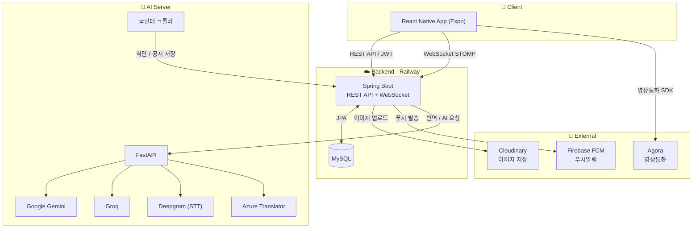

<div align="center">

# Kutoring 🇰🇷

**외국인 유학생과 한국인 헬퍼를 연결하는 P2P 헬프 매칭 플랫폼**

[](https://spring.io/projects/spring-boot)
[](https://openjdk.org/)
[](https://www.mysql.com/)
[](https://railway.app/)

</div>

---

## 1. 프로젝트 소개

Kutoring은 한국에 거주하는 **외국인 유학생**과 도움을 줄 수 있는 **한국인 헬퍼**를 매칭해주는 서비스입니다.  
병원 동행, 행정 처리, 통역, 일상 심부름 등 다양한 생활 도움 요청을 쉽고 빠르게 해결할 수 있습니다.

### 주요 기능

| 기능 | 설명 |
|------|------|
| 회원가입 / 로그인 | 이메일 인증 기반 JWT 인증 |
| 헬퍼 추천 | AI 기반 맞춤 헬퍼 추천 |
| 도움 요청 | 카테고리별 도움 요청 게시 및 매칭 |
| 실시간 채팅 | WebSocket(STOMP) 기반 1:1 채팅 |
| 영상 통화 | Agora SDK 기반 화상 통화 |
| 커뮤니티 | 유학생 전용 커뮤니티 게시판 |
| 리뷰 & 신고 | 헬퍼 리뷰 작성 및 신고 기능 |
| 식단 / 공지 | 학내 식단 및 공지사항 자동 수집 |
| 관리자 | 사용자 관리, 신고 처리 어드민 페이지 |

### 🛠 기술 스택

**💻 Frontend**

| 역할 | 종류 |
|------|------|
| Programming Language |  |
| Framework |   |
| Navigation |  |
| State Management |  |
| Real-time |  |
| Video Call |  |
| i18n |  |

**💻 Backend**

| 역할 | 종류 |
|------|------|
| Programming Language |  |
| Framework |  |
| Build Tool |  |
| API |  |
| Database |  |
| Security |  |
| Real-time |  |
| Image Storage |  |
| Video Call |  |

**💻 AI**

| 역할 | 종류 |
|------|------|
| Programming Language |  |
| API Server |  |
| AI |   |
| STT |  |
| Translation |  |
| Crawling |  |

**💻 Deployment**

| 역할 | 종류 |
|------|------|
| Deployment |   |

**💻 Common**

| 역할 | 종류 |
|------|------|
| Version Control |   |
| Design |  |
| Communication |  |
| Project Management |  |

### 🏗 서비스 아키텍처



### 📊 ERD

```mermaid
erDiagram
    users {
        bigint id PK
        string email UK
        string nickname
        enum user_type "INTERNATIONAL·EXCHANGE·KOREAN"
        string university
        string preferred_language
        string nationality
        double rating
        int help_count
        boolean email_verified
        boolean student_id_verified
        enum student_id_status "NONE·PENDING·APPROVED·REJECTED"
        boolean is_admin
        string fcm_token
        datetime created_at
        datetime updated_at
    }

    help_requests {
        bigint id PK
        string title
        text description
        enum category "BANK·HOSPITAL·SCHOOL·DAILY·OTHER"
        enum help_method "CHAT·VIDEO_CALL·OFFLINE"
        enum status "WAITING·MATCHED·IN_PROGRESS·COMPLETED·CANCELLED"
        bigint requester_id FK
        bigint helper_id FK
        datetime created_at
    }

    chat_messages {
        bigint id PK
        bigint room_id FK
        bigint sender_id FK
        text content
        string original_language
        text translated_content
        text cultural_note
        boolean is_read
        datetime created_at
    }

    direct_chat_rooms {
        bigint id PK
        bigint user1_id FK
        bigint user2_id FK
        boolean left_by_user1
        boolean left_by_user2
        datetime created_at
    }

    direct_chat_messages {
        bigint id PK
        bigint room_id FK
        bigint sender_id FK
        text content
        boolean is_read
        datetime created_at
    }

    community_posts {
        bigint id PK
        enum category "INFO·QUESTION·CHAT·CULTURE"
        string title
        text content
        bigint author_id FK
        int likes
        datetime created_at
    }

    post_comments {
        bigint id PK
        bigint post_id FK
        bigint author_id FK
        bigint parent_comment_id FK
        text content
        datetime created_at
    }

    post_likes {
        bigint id PK
        bigint post_id FK
        bigint user_id FK
    }

    post_translations {
        bigint id PK
        bigint post_id FK
        string lang_code
        text title
        text content
    }

    comment_translations {
        bigint id PK
        bigint comment_id FK
        string lang_code
        text content
    }

    reviews {
        bigint id PK
        bigint help_request_id FK
        bigint reviewer_id FK
        bigint reviewee_id FK
        int rating
        text comment
        datetime created_at
    }

    reports {
        bigint id PK
        bigint reporter_id FK
        bigint target_user_id FK
        enum target_type "USER·POST·HELP_REQUEST"
        enum status "PENDING·RESOLVED·REJECTED"
        text reason
        datetime created_at
    }

    notifications {
        bigint id PK
        bigint recipient_id FK
        enum type
        string message
        bigint reference_id
        boolean is_read
        datetime created_at
    }

    meals {
        bigint id PK
        date meal_date
        string cafeteria
        string corner
        text menu
        datetime created_at
    }

    meal_translations {
        bigint id PK
        bigint meal_id FK
        string lang_code
        text menu
    }

    notices {
        bigint id PK
        string category_id
        text title_ko
        string link UK
        date pub_date
        datetime created_at
    }

    notice_translations {
        bigint id PK
        bigint notice_id FK
        string lang_code
        text title
    }

    email_verifications {
        bigint id PK
        string email
        string code
        datetime expires_at
        boolean used
        datetime created_at
    }

    user_blocks {
        bigint id PK
        bigint blocker_id FK
        bigint blocked_id FK
        datetime created_at
    }

    users ||--o{ help_requests : "요청자"
    users ||--o{ help_requests : "헬퍼"
    users ||--o{ chat_messages : "발신자"
    users ||--o{ direct_chat_rooms : "user1"
    users ||--o{ direct_chat_rooms : "user2"
    users ||--o{ direct_chat_messages : "발신자"
    users ||--o{ community_posts : "작성자"
    users ||--o{ post_comments : "작성자"
    users ||--o{ post_likes : "좋아요"
    users ||--o{ reviews : "리뷰어"
    users ||--o{ reviews : "대상자"
    users ||--o{ reports : "신고자"
    users ||--o{ reports : "피신고자"
    users ||--o{ notifications : "수신자"
    users ||--o{ user_blocks : "차단자"
    users ||--o{ user_blocks : "피차단자"

    help_requests ||--o{ chat_messages : "채팅방"
    help_requests ||--o{ reviews : "리뷰"

    direct_chat_rooms ||--o{ direct_chat_messages : "메시지"

    community_posts ||--o{ post_comments : "댓글"
    community_posts ||--o{ post_likes : "좋아요"
    community_posts ||--o{ post_translations : "번역"

    post_comments ||--o{ comment_translations : "번역"
    post_comments ||--o{ post_comments : "대댓글"

    meals ||--o{ meal_translations : "번역"
    notices ||--o{ notice_translations : "번역"
```



---

## 2. 소개 영상

> 프로젝트 소개 영상을 아래에 추가하세요.

[](#)

---

## 3. 팀 소개

**국민대학교 캡스톤 디자인 13조**

<table>
  <tr>
    <td align="center">
      <b>박상범</b><br/>
      팀장 · Frontend<br/>
      <a href="mailto:">📧 이메일</a>
    </td>
    <td align="center">
      <b>김영일</b><br/>
      Backend<br/>
      <a href="mailto:">📧 이메일</a>
    </td>
    <td align="center">
      <b>이상윤</b><br/>
      Backend<br/>
      <a href="mailto:">📧 이메일</a>
    </td>
    <td align="center">
      <b>이준서</b><br/>
      Frontend<br/>
      <a href="mailto:">📧 이메일</a>
    </td>
    <td align="center">
      <b>조보국</b><br/>
      AI<br/>
      <a href="mailto:">📧 이메일</a>
    </td>
  </tr>
</table>

---

## 4. 사용법

### 사전 준비

- Java 17 이상
- Docker & Docker Compose
- MySQL 8.0 (또는 Docker로 실행)

### 설치 및 실행

**1. 저장소 클론**

```bash
git clone https://github.com/helpboys/capstone-13.git
cd capstone-13
```

**2. MySQL 실행 (Docker)**

```bash
docker-compose up -d
```

> DB: `helpboys` / User: `helpboys` / Password: `helpboys1234` / Port: `3306`

**3. 애플리케이션 실행**

```bash
./gradlew bootRun
```

**4. 빌드**

```bash
./gradlew build
```

### WebSocket 엔드포인트

| 항목 | 값 |
|------|-----|
| 연결 | `/ws` (SockJS) |
| 채팅방 구독 | `/topic/chat/{roomId}` |
| 메시지 전송 | `/app/chat/send` |

### API 응답 형식

```json
// 성공
{
  "success": true,
  "message": "성공",
  "data": { ... }
}

// 실패
{
  "success": false,
  "message": "에러 메시지",
  "data": null
}
```

---

## 5. 기타

### 브랜치 전략

```
master          ← 배포 브랜치 (직접 push 금지)
└── feature/*  ← 기능 개발
└── fix/*       ← 버그 수정
└── refactor/* ← 리팩토링
```

PR을 통해서만 `master`에 병합합니다.

### 커밋 컨벤션

| 타입 | 설명 |
|------|------|
| `[feat]` | 새로운 기능 추가 |
| `[fix]` | 버그 수정 |
| `[refactor]` | 코드 구조 개선 (기능 변화 없음) |
| `[docs]` | 문서 수정 |
| `[chore]` | 설정, 의존성 변경 |
| `[test]` | 테스트 코드 |

---

<div align="center">

**Kutoring** · 국민대학교 캡스톤 디자인 13조

</div>